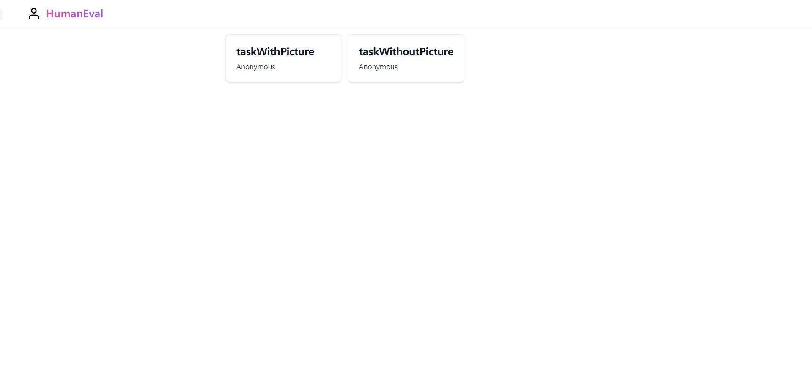
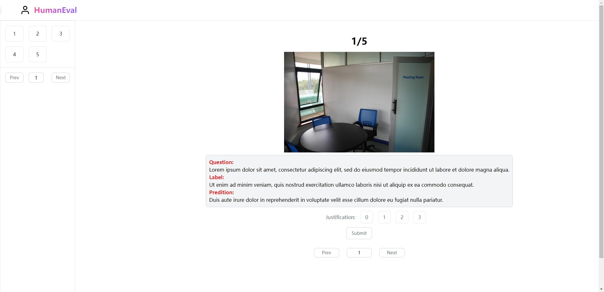
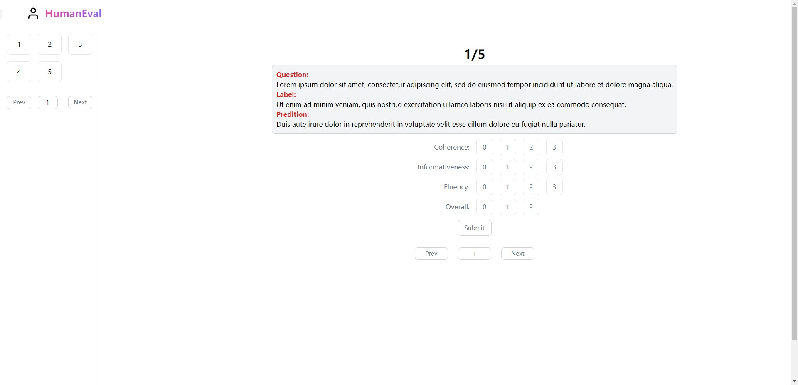

# Human Evaluation System
A simple human evaluation system based on [Flask](https://github.com/pallets/flask) and [Tailwind CSS](https://tailwindcss.com/).

## Showcase
Homepage:

Task with pictures:

Task without pictures:

## Requirements
- Python 3.8
- Flask==2.3.2
- pyyaml=6.0

## Usage
### Prepare data
Put the examples of data are in `/static/resources/{dataName}.json`. If you want to include pictures, remember to set the argument `path` in the json file.
### Add config
The examples of config are in `config.yml`. First add the `name`, and add `author`, `usePicture`, `totalNum`, `datasetPath`, and `criterion` following the `name`.
### Generate results
Execute the command `python init_results.py -t {name}` or `python init_results.py --task {name}`, where the `name` is the same as the previous section.
### Start evaluating
Execute the command `python main.py` and enter the `http://127.0.0.1:5000` in the browser.